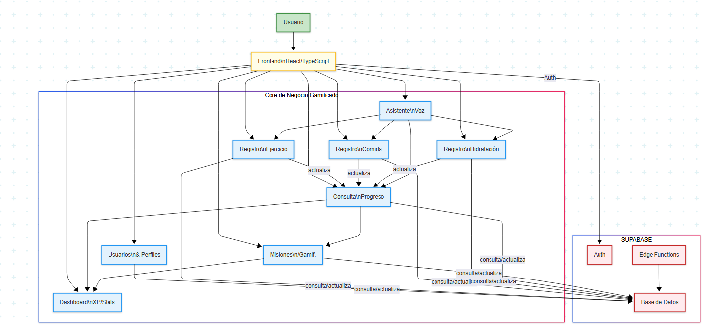

-----

## 1\. Bienvenida a Entrenamiento por Niveles: Tu Aventura de Fitness Gamificada

**Entrenamiento por Niveles** es una innovadora aplicación móvil diseñada para transformar tu viaje de fitness en una emocionante aventura gamificada. Olvídate de las aburridas hojas de cálculo de seguimiento; con Entrenamiento por Niveles, cada entrenamiento, cada comida saludable y cada meta de hidratación te acerca a convertirte en un "cazador" de élite en tu propia historia de progreso.

Esta aplicación te permite registrar tus ejercicios, monitorear tu nutrición e hidratación, y completar misiones diarias, todo mientras ganas **puntos de experiencia (XP)** y mejoras tus **estadísticas vitales** como Fuerza (STR), Agilidad (AGI), Inteligencia (INT) y Carisma (CHA). Con desafiantes "**raids de jefes**" virtuales y un **asistente de voz** integrado para un seguimiento manos libres, Entrenamiento por Niveles no solo te ayuda a alcanzar tus objetivos, sino que convierte el proceso en una experiencia inmersiva y gratificante. Prepárate para subir de nivel tu vida, un ejercicio a la vez.

-----

## 2\. Características Principales

### 2.1. Panel Principal (Dashboard)

Tu centro de comando principal, el **Panel Principal**, ofrece una visión inmediata de tu progreso:

  * **Estado del Cazador (Hunter Status):** De un vistazo, consulta tu **nivel actual**, la cantidad de **días que has estado activo** en tu viaje y tu **registro** general, que refleja tus esfuerzos constantes.
  * **XP Progress:** Una representación visual clara muestra cómo tus **puntos de experiencia (XP) se acumulan** hacia el siguiente nivel, proporcionando un impulso constante para lograr más.
  * **Estadísticas (Stats):** Monitorea tus atributos principales: **Fuerza (STR)**, **Agilidad (AGI)**, **Inteligencia (INT)** y **Carisma (CHA)**. Estas estadísticas no son solo números; pueden estar vinculadas al progreso dentro de la aplicación o desbloquear logros únicos, reflejando directamente tu crecimiento físico y mental.
  * **Raids de Jefes Activos (Active Boss Raids):** Participa en desafiantes "**raids de jefes**" virtuales que corresponden a objetivos de fitness específicos o rutinas intensas. Conquista a estos "jefes" para ganar recompensas significativas y reconocimiento.
  * **Logros Recientes (Recent Achievements):** Una pantalla dinámica destaca tus **hitos y logros desbloqueados recientemente**, celebrando cada paso de tu progreso.

### 2.2. Misiones (Missions)

Mantente en el camino con objetivos estructurados a través de misiones atractivas:

  * **Misiones Diarias - Entrenamiento por Niveles:** Completa estas **misiones diarias obligatorias** para ganar recompensas y evitar penalizaciones. Sigue el progreso de tu finalización y el tiempo restante para cada misión, asegurando que mantengas hábitos consistentes.

### 2.3. Contador de Ejercicios (Exercise Counter)

Registra y rastrea tus entrenamientos de manera eficiente:

  * **Registro de Ejercicios:** Registra fácilmente una **amplia variedad de ejercicios**, desde "Abdominales (core)" hasta levantamiento de pesas y cardio.
  * **Seguimiento de Series y Repeticiones:** Ingresa tus **series y repeticiones**, con **temporizadores de descanso integrados** para optimizar la estructura de tu entrenamiento.
  * **Cálculo de XP por Repetición:** Gana **puntos de experiencia directamente basados en tu rendimiento en el ejercicio**, creando un vínculo tangible entre tu esfuerzo y la progresión en la aplicación.

### 2.4. Nutrición (Nutrition Tracker)

Alimenta tu cuerpo como un verdadero cazador:

  * **Nutrición de Cazador (Hunter Nutrition):** Monitorea tu ingesta diaria de **Calorías, Proteínas, Carbohidratos y Grasas**, ayudándote a mantener una dieta equilibrada.
  * **Comidas Saludables Hoy:** Controla el **número de comidas saludables** que has consumido cada día.
  * **Tipo de Comida:** Categoriza tus comidas como **Desayuno, Almuerzo, Cena o Snack** para una mejor organización.
  * **Cantidad de Porciones:** Especifica con precisión el **número de porciones** consumidas para cada alimento.
  * **Comidas Saludables (+2 XP):** Registrar opciones saludables como **Pechuga de Pollo, Arroz Integral, Brócoli o Salmón** otorga un **bono de +2 XP**, reforzando los hábitos alimenticios positivos.
  * **Comidas No Saludables (-1 XP):** Ten en cuenta que las opciones menos saludables, como **Hamburguesas o Pizza**, pueden deducir **-1 XP**, fomentando decisiones más saludables.

### 2.5. Hidratación (Hydration Tracker)

Mantén tus niveles de energía altos con una hidratación adecuada:

  * **Objetivo Diario:** Establece y rastrea tu **meta diaria de ingesta de agua** (por ejemplo, 2500ml), con una barra de progreso visual.
  * **Tipo de Bebida:** Registra varias bebidas, incluyendo **Agua, Té, Café y Bebida Deportiva**.
  * **Cantidades Rápidas:** Agrega rápidamente cantidades comunes como **250ml, 500ml, 750ml o 1000ml**.
  * **Cantidad Personalizada:** Ingresa **cantidades de hidratación personalizadas** para una flexibilidad total.
  * **Historial de Hoy:** Revisa un claro **registro de tu hidratación diaria**.
  * **Consejos de Hidratación (Hydration Tips):** Obtén **consejos útiles para mejorar tus hábitos de hidratación** y optimizar tu rendimiento.

### 2.6. Asistente de Voz (Voice Assistant)

Controla tu viaje de fitness con manos libres:

  * "Habla naturalmente para registrar ejercicios, hidratación y consultar tu progreso. El sistema entenderá tus comandos automáticamente." Esta característica avanzada te permite registrar actividades, rastrear la hidratación y verificar tu estado sin esfuerzo utilizando comandos de voz simples, haciendo que el seguimiento sea fluido y conveniente.

-----

## 3\. Arquitectura de la Solución

La arquitectura de "Entrenamiento por Niveles" se ha diseñado para ser modular, escalable y mantenible, siguiendo un enfoque de "Core de Negocio Gamificado" respaldado por un potente BaaS (Backend as a Service).

### 3.1. Vista Lógica: Core de Negocio Gamificado

El corazón de la aplicación está compuesto por un conjunto de módulos lógicos que gestionan la funcionalidad central:

  * **Gestión de Usuarios y Perfiles:** Maneja la autenticación, autorización y datos del perfil del cazador.
  * **Motor de Gamificación:** La lógica central para calcular XP, gestionar niveles, actualizar estadísticas (STR, AGI, INT, CHA), y aplicar recompensas/penalizaciones.
  * **Gestión de Misiones y Raids:** Define, asigna y rastrea el progreso de misiones diarias y raids de jefes.
  * **Contador de Ejercicios:** Permite el registro detallado de entrenamientos (series, repeticiones, temporizadores).
  * **Gestión de Nutrición:** Controla la ingesta de alimentos, macros y la categorización de comidas saludables.
  * **Gestión de Hidratación:** Rastrea el consumo de líquidos y objetivos de hidratación.
  * **Asistente de Voz:** Procesa comandos de lenguaje natural para interactuar con los módulos de registro.
  * **Panel de Control / Dashboard:** Consolida y visualiza el progreso del usuario de todos los módulos.

### 3.2. Vista Física (Despliegue)

La aplicación se despliega como una solución **frontend-driven** que se comunica con un robusto Backend-as-a-Service (BaaS):

  * **Frontend (Cliente):** La aplicación React/TypeScript se compila en archivos estáticos que pueden ser alojados en cualquier proveedor de hosting estático (por ejemplo, Netlify, Vercel, AWS S3/CloudFront).
  * **Backend (Supabase):**
      * **Base de Datos (PostgreSQL):** Almacena todos los datos estructurados del usuario, ejercicios, nutrición, misiones, logros, XP, estadísticas, etc., garantizando integridad y escalabilidad.
      * **Autenticación:** Gestiona de forma segura el registro, inicio de sesión y sesiones de usuario.
      * **Edge Functions (Serverless):** Para la lógica de negocio compleja que requiere procesamiento en el servidor (por ejemplo, cálculos detallados de XP/nivel, procesamiento de comandos del asistente de voz, validaciones de misiones, integraciones con servicios externos de NLP).
  * **Comunicación:** El frontend se comunica con Supabase a través de sus APIs RESTful y capacidades en tiempo real para obtener y persistir datos. Las Edge Functions se invocan mediante llamadas API para ejecutar la lógica de negocio.

### 3.3. Estrategia de Despliegue y Operación

  * **Despliegue Continuo (CD):** Se configurará un pipeline de CI/CD (por ejemplo, GitHub Actions, GitLab CI/CD) para automatizar el despliegue del frontend cada vez que se fusionen cambios a la rama principal. Supabase gestiona el despliegue de la base de datos y las Edge Functions.
  * **Monitoreo:** Se implementarán herramientas de monitoreo para rastrear:
      * **Rendimiento del Frontend:** Tiempos de carga, interacciones del usuario (por ejemplo, Google Analytics, Vercel Analytics).
      * **Errores:** Captura y reporte de errores en tiempo real (por ejemplo, Sentry).
      * **Métricas de Supabase:** Uso de base de datos, rendimiento de consultas, logs de Edge Functions.
  * **Mantenimiento:** Se realizarán actualizaciones regulares de dependencias y optimización de consultas a la base de datos.

-----

## 4\. Tecnologías Utilizadas

### 4.1. Frontend

  * **React:** Biblioteca JavaScript para construir interfaces de usuario dinámicas y reactivas.
  * **TypeScript:** Superconjunto de JavaScript que añade tipado estático para mayor robustez y mantenibilidad del código.
  * **Vite:** Herramienta de construcción de frontend rápida y eficiente.
  * **Tailwind CSS:** Framework CSS de utilidad para un diseño rápido y personalizado.
  * **Framer Motion:** Librería para animaciones fluidas en React.
  * **Lucide React:** Colección de iconos ligeros.
  * **Recharts:** Librería de gráficos para visualización de datos.
  * **date-fns:** Librería para manipulación de fechas.
  * **React Router DOM:** Para el enrutamiento declarativo en la aplicación.

### 4.2. Backend & Base de Datos (BaaS)

  * **Supabase:**
      * **PostgreSQL:** Base de datos relacional robusta para persistencia de datos.
      * **Supabase Auth:** Sistema de autenticación de usuarios.
      * **Supabase Realtime:** Capacidades en tiempo real para actualizaciones dinámicas.
      * **Supabase Storage:** Para gestión de archivos (si aplica en el futuro).
      * **Supabase Edge Functions:** Funciones serverless para la lógica de negocio del lado del servidor (por ejemplo, Motor de Gamificación complejo, procesamiento de comandos de voz).